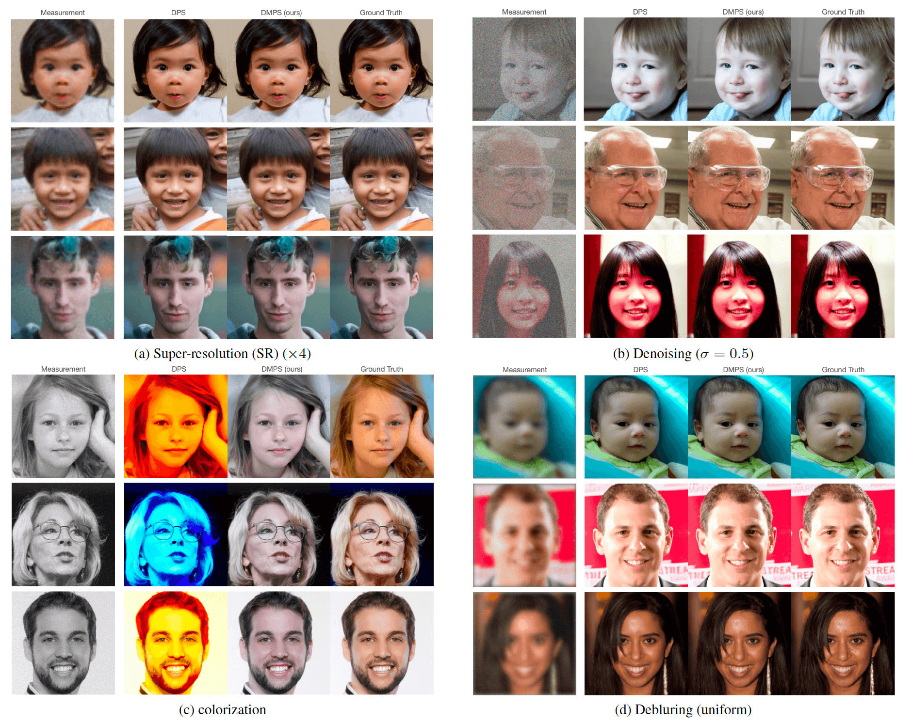

# Pytorch Code for "Diffusion Model Based Posterior Samplng for Noisy Linear Inverse Problems"

[Diffusion Model Based Posterior Samplng for Noisy Linear Inverse Problems](https://arxiv.org/abs/2211.12343)


## Brief Summary
Based on diffusion models (DM), we propose a general-purpose posterior sampler called diffusion model based posterior sampling (DMPS) to address the ubiquitous noisy linear inverse problems y = Ax + n. To address the intractability of exact noise-perturbed likelihood score, a simple yet effective noise-perturbed pseudo-likelihood score is introduced. 
We evaluate the efficacy of DMPS on a variety of linear inverse problems such as image super-resolution, denoising, deblurring, colorization. Experimental results demonstrate that, for both in-distribution and out-of-distribution samples,  DMPS achieves highly competitive or even better performances on multiple tasks than the leading competitors. 


**Extension**: A generalization of dmps to the GLM case with non-linear measurments, in particular quantized measurements, can be found in this [Quantized Compressed Sensing with Score-Based Generative Models](https://arxiv.org/abs/2211.13006) (code is avaliable at  [QCS-SGM](https://github.com/mengxiangming/QCS-SGM) )

**Notice**: While we did not provide examples of DMPS on (unquantized) compressed sensing, its application in CS is straightforward and the associated results will be updated soon. For a first reference, please refer to the Appendix of [Quantized Compressed Sensing with Score-Based Generative Models](https://arxiv.org/abs/2211.13006). 

-----------------------------------------------------------------------------------------
Results of DMPS on different tasks in noisy image restoration. 



## Prerequisites
- python 3.8

- pytorch 1.11.0

- CUDA 11.3.1 (other version is also fine)


## Getting started 


### Step 1: Set environment

Create a new environment and install dependencies

```
conda create -n DMPS python=3.8

conda activate DMPS

pip install -r requirements.txt

pip install torch==1.11.0+cu113 torchvision==0.12.0+cu113 torchaudio==0.11.0 --extra-index-url https://download.pytorch.org/whl/cu113
```

If you fail to install mpi4py using the pip install, you can try conda as follows
```
conda install mpi4py
```

In addition, you might need 

```
pip install scikit-image
pip install blobfile
```

Finally, make sure the code is run on GPU, though it can run on cpu as well.  


### Step 2:  Download pretrained checkpoint
For FFHQ, download the pretrained checkpoint "ffhq_10m.pt"  from  [link_ffhq_checkpoint](https://drive.google.com/drive/folders/1jElnRoFv7b31fG0v6pTSQkelbSX3xGZh?usp=sharing), and paste it to ./models/


For LSUN bedroom and LSUN cat, download the pretrained checkpoints "lsun_bedroom.pt"  and  "lsun_cat.pt"  from  [link_lsun_checkpoint](https://github.com/openai/guided-diffusion), , and paste it to ./models/

### Step 3:  Prepare the dataset
You need to write your data directory at data.root. Default is ./data/samples which contains three sample images from FFHQ validation set. We also provide other demo data samples in ./data/ used in our paper.

### Step 4: Perform Posterior Sampling for different tasks 

```
python3 main.py \
--model_config=configs/model_config.yaml \
--diffusion_config=configs/diffusion_config.yaml \
--task_config={TASK-CONFIG};
--save_dir './saved_results'
```


## Possible model configurations

```
- configs/model_config.yaml 
- configs/model_config_lsunbedroom.yaml
- configs/model_config_lsuncat.yaml

```


## Possible task configurations
```
# Various linear inverse problems
- configs/sr4_config.yaml
- configs/deblur_gauss_config.yaml
- configs/deblur_uniform_config.yaml
- configs/denoise_config.yaml
- configs/color_config.yaml

```


## Citation 
If you find the code useful for your research, please consider citing as 

```
@article{meng2022diffusion,
  title={Diffusion Posterior Sampling for General Noisy Inverse Problems},
  author={Meng, Xiangming and Kabashima, Yoshiyuki},
  journal={arXiv preprint arXiv:2211.12343},
  year={2022}
}

```


## References

This repo is developed based on  [DPS code](https://github.com/DPS2022/diffusion-posterior-sampling) and  [DDRM code](https://github.com/bahjat-kawar/ddrm). Please also consider citing them if you use this repo. 
```

@inproceedings{kawar2022denoising,
    title={Denoising Diffusion Restoration Models},
    author={Bahjat Kawar and Michael Elad and Stefano Ermon and Jiaming Song},
    booktitle={Advances in Neural Information Processing Systems},
    year={2022}
}

@article{chung2022diffusion,
  title={Diffusion Posterior Sampling for General Noisy Inverse Problems},
  author={Chung, Hyungjin and Kim, Jeongsol and Mccann, Michael T and Klasky, Marc L and Ye, Jong Chul},
  journal={arXiv preprint arXiv:2209.14687},
  year={2022}
}

```
